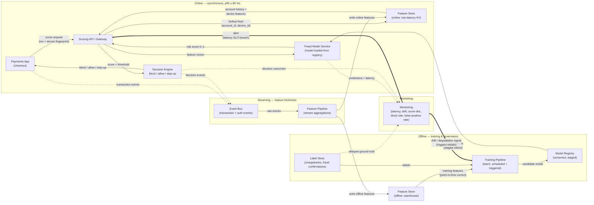

# Architecture — Scenario A: Real-time Fraud Scoring

Serving pattern: **online (synchronous request/response)** on the payment path,
with **streaming** feature updates and **batch** training off the critical path.

## Reading the diagram

- **Serving boundary.** Everything in the `ONLINE` box runs inside the 80 ms budget
  on the synchronous payment path. `STREAM` keeps the online feature store fresh but
  is not blocking. `OFFLINE` (training, registry, labels) runs entirely off the
  critical path.
- **Contracts on the arrows.** Solid arrows = synchronous request/response in the
  latency budget. Dotted arrows = asynchronous events. Bold arrows = control signals
  (retrain trigger, SLO alert).
- **Two-tier feature store.** The same features are materialized twice: an online
  low-latency KV store for serving and an offline warehouse copy for point-in-time
  correct training. The pipeline is the single writer to both, which keeps
  train/serve skew controlled.
- **Feedback loop.** Monitoring watches live predictions and decisions, joins them
  against delayed ground truth from the label store (chargebacks land days later),
  and emits a drift/degradation signal that triggers the training pipeline. New
  models flow back to serving only through the registry via a staged rollout.

## Component inventory

| Component | Plane | Responsibility |
|---|---|---|
| Payments App | online | Issues score request at checkout, applies the decision |
| Scoring API / Gateway | online | Orchestrates feature lookup + inference, enforces timeout/fallback |
| Feature Store (online) | online | Low-latency KV reads of account history + device features |
| Fraud Model Service | online | Stateless inference, model pulled from registry |
| Decision Engine | online | Maps score → block / allow / step-up via thresholds |
| Event Bus | streaming | Transports transaction, auth, and decision events |
| Feature Pipeline | streaming | Computes aggregations, writes online + offline stores |
| Feature Store (offline) | offline | Warehouse copy for point-in-time-correct training |
| Label Store | offline | Confirmed-fraud and chargeback labels (delayed) |
| Training Pipeline | offline | Scheduled + drift-triggered retraining |
| Model Registry | offline | Versioned models, staged promotion to serving |
| Monitoring | cross-cutting | Latency/SLO, score drift, FP rate; emits retrain + alert signals |
